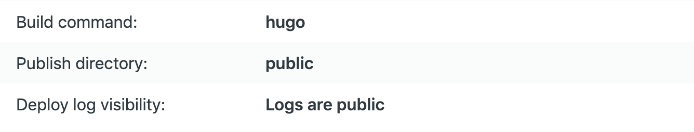

```{r setup, include=FALSE}
knitr::opts_chunk$set(echo = FALSE)
```

## Hello World!

- https://barug2019.netlify.com/
- Have a GitHub/GitLab/BitBucket account
   - Create a new repo `BlogdownExample` and clone 
   - Create a R project and point the path to the folder
   - `blogdown::new_site()`
   - `blogdown::serve_site()`
   - `blogdown::build_site()`
   - `blogdown::new_post("Another awesome post")`
   
## Deploy

- Link your repo to Netlify: New site from Git
- Deploy: 

<center>
{width=30%}
</center>

- General -> Change site name 

## Go under the hood

- theme: http://themes.gohugo.io (themes do not work well with blogdown: https://github.com/rstudio/blogdown/issues)
- `blogdown::new_site(theme="frjo/hugo-theme-zen")`
- `config.toml`
- `content/`
- `static/`
- `themes/`
- `layouts/`

Modified version:

- https://github.com/happyrabbit/scientistcafe.com

## Other ways to build and deploy your own website

1. One-click solution: https://templates.netlify.com
2. Fork a template to GitHub/GitLab and link it to Netlify 
    - Jekyll: http://jekyllthemes.org
    - Hugo: https://themes.gohugo.io
    
## Why Static Sites   

## Static Site Generators


   